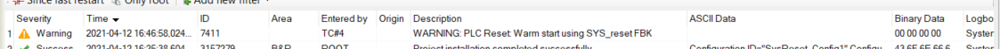

# SysReset mode 0x11 (shutdown) sample project

This is a sample project to demonstrate how to execute a controlled shutdown of the PLC.
A controlled shutdown of the PLC ensures the integrity of the file system on the CF / CFast.

A controlled shutdown must be triggered several seconds **before** the 24VDC supply to the PLC is cut off. This applies to the following use cases, which are both covered by this sample project:
1. A buffer module, such as 0PB0200.1, is used to keep the 24VDC supply alive after a power failure. While running on the buffered 24VDC, the PLC shuts down in a controlled fashion.
2. The operator triggers a controlled shutdown of the machine by pressing a button on the visualization. Then, the operator switches off the machine power supply via the main switch.

## System requirements
- This project was created in [B&R Automation Studio] 4.9. The source code can be used in older versions of AS, but you may get an error when opening the project.
- Automation runtime AR >= D4.63 or AR >= A4.73

## Getting started
The most important task is "SysRst". This task calls the function SysReset(0x11), which shuts down the PLC. The other tasks "DevLinker" and "HelloFile" are used to demonstrate how to preserve file consistency in the event of a shutdown.

"DevLinker" links the necessary file device and has no interface with other tasks.

"HelloFile" creates and writes to a text file. It has a PV mapping interface with "SysRst". "SysRst" awaits "HelloFile" if a shutdown is pending but the file system is still active. "SysRst" also blocks "HelloFile" if a shutdown is pending and no new file operations shall be started.

### 1. 24VDC buffer module
_If a 24VDC buffer module is unavailable, you may skip this section._

1. Wire the buffer module according to the datasheet. Make sure to connect the CPU to the buffered voltage supply.
2. Connect the "Power Good" signal of the power supply to a digital input
3. Map the digital input to the PV "::SysRst:diVdc24Ok"
4. Download the project to the target
5. Test if the shutdown works as expected by disconnecting your 24VDC power supply from the mains. You should see a logger entry like this:

### 2. Shutdown triggered by user
1. Download the project to the target
2. In Automation Studio, open the watch of task "SysRst"
3. Set the local variable "iCmdShutdown" to TRUE
4. After a short time, the online communication to the CPU is lost
5. Power-cycle the CPU to restart it

## Reference
- [24VDC buffer module 0PB0200.1]
- SYSreset() documentation. AS help GUID: be301d61-d2d3-4b74-b331-911d77756932

## License
[MIT](https://en.wikipedia.org/wiki/MIT_License)

[B&R Automation Studio]: https://www.br-automation.com/en/products/software/automation-software/automation-studio/
[24VDC buffer module 0PB0200.1]: https://www.br-automation.com/en/products/accessories/power-supplies/buffer-module/0pb02001/
